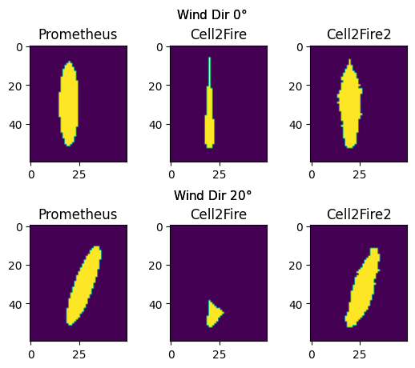

# Cell2Fire2: A modified version of Cell2Fire that actually works

### Developed by Giovanni Corti 
Based on work by Cristobal Pais, Jaime Carrasco, David Martell, David L. Woodruff, Andres Weintraub

# Introduction

Cell2Fire (https://github.com/cell2fire/Cell2Fire) is a fire growth engine that uses a cellular automata scheme to efficiently grow fires according to the Canadian FBP system. The AISIX wildfire model uses Cell2Fire (one of the two fire growth engines supported by BP3+) as the low computation cost is needed in order to cost-effectively simulate a sufficient enough number of fires. 

Unfortunately Cell2Fire drastically underestimates the spread of large fires and displays substantial anisotropy. To address these issues I make three changes to the fire growth scheme as summarized below. This altered version of Cell2Fire is referred to as Cell2Fire2.

# Change Summary

1) Randomized cell centers following the method described [here](doi.org/10.1007/978-3-642-33350-7_29). This effectively allows for more variance in fire spread distance and direction for a given cell in the Moore neighborhood. A major caveat here is that it makes the fire-growth engine non-deterministic. 
2) Fire spread to up to 3 additional cells. These cells are chosen such that they are well aligned with the direction of fire spread and allow the shape of large fires to be better captured. For reasons of computational efficiency, this is only done for large fires.
3) Spillover tracking to account for fire spread that passes the cell center. This allows for more accurate fire spread, especially at larger time steps. 

   
# Requirements
- g++
- Boost (C++)
- Eigen (C++)

# Spread Improvement Example
The plot below shows an example of the improved fire spread provided by Cell2Fire2. The Prometheus output here can be considered the desired, but computationally expensive, outcome.

# Important notes
1) Cell2Fire2 is not an exact drop-in replacement for Cell2Fire when it comes to BP3+. Instead growth-cell2fire.R, a file in the BurnP3PlusCell2Fire package must be modified slightly. This modified file is included the Cell2Fire2 github repo
2) Cell2Fire2 can be compiled to create either a Windows or Linux executable. This executable is ultimately what is used by BP3+. To create the executable run either `mingw32-make` (Windows) or `make` (Linux) in the Cell2Fire2/cell2fire directory.
